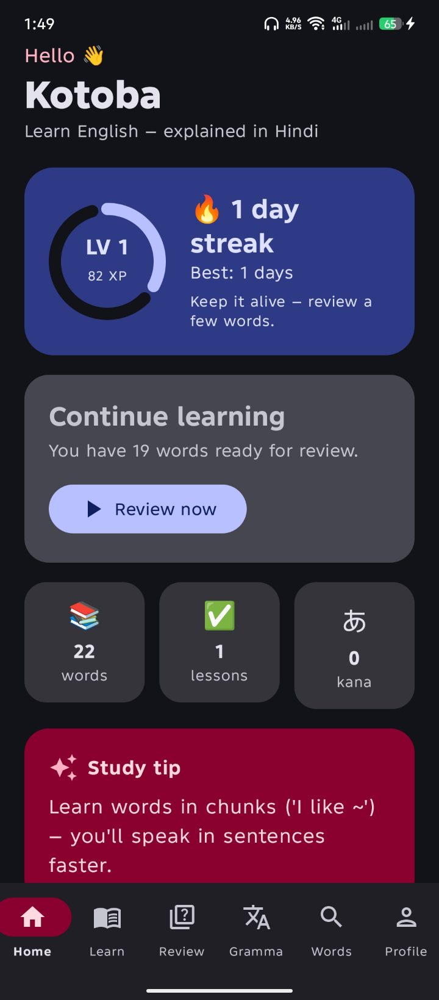
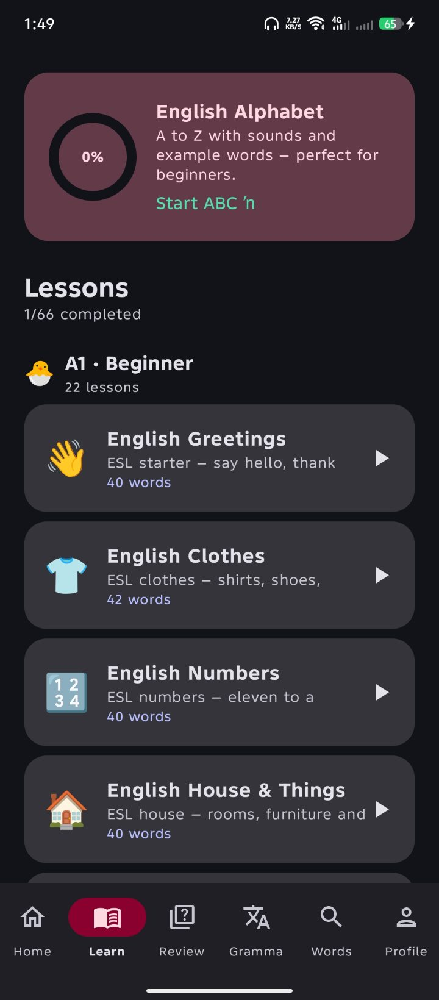
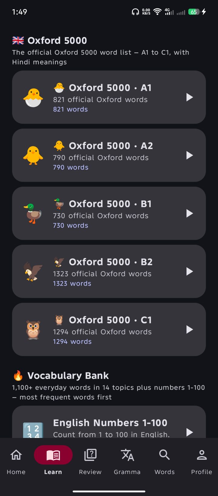
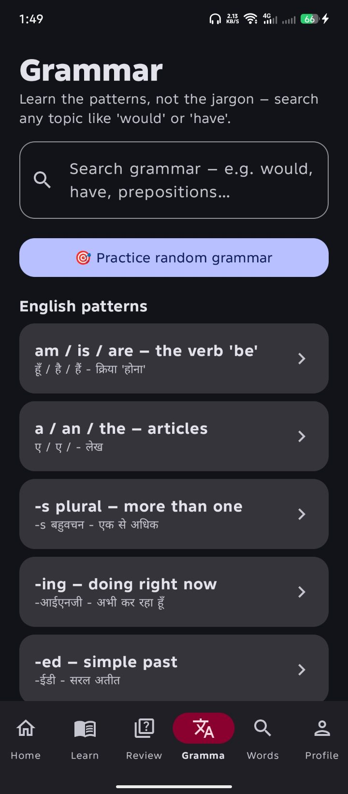
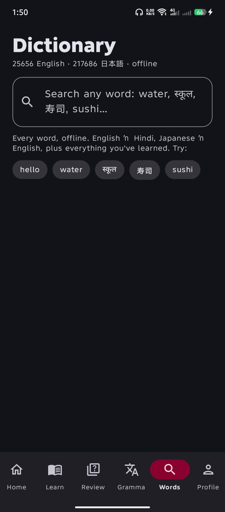
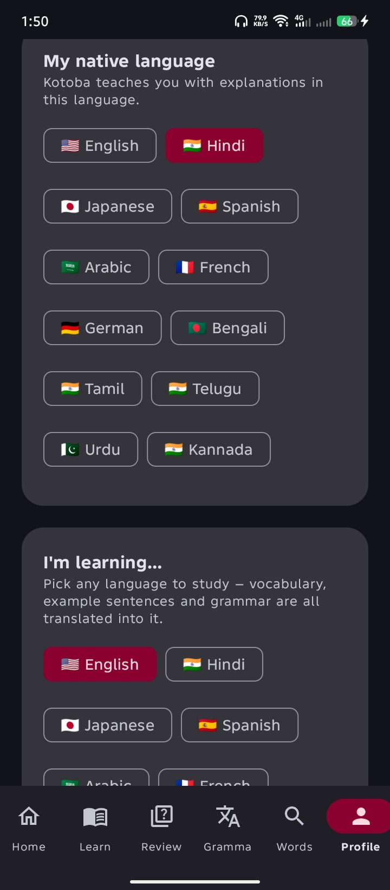

# Kotoba

**Learn any language — explained in yours.**

Kotoba is a free, offline-first language-learning Android app. Pick the language you speak (12 supported) and the language you want to learn (also 12), and the entire curriculum — vocabulary, example sentences, grammar patterns and roleplay conversations — is taught with meanings and explanations **in your own language**. Japanese and English are hand-authored; the other tracks are built on the fly from the English course through bundled offline gloss tables, so no track ever falls back to a language you don't read.

Built on well-established language-learning research:

- **Spaced Repetition (SM-2)** — every word gets its own schedule (10 min → 1 day → 6 days → …). Wrong answers return quickly, right answers stretch out. This "forgetting curve" timing is the highest-leverage technique for long-term retention.
- **Picture association over translation** — every word is taught with an emoji and an image-first prompt, so learners map *meaning directly to sound*, the way native speakers and children do, instead of translating through a third language.
- **Chunking / sentence patterns** — learners study whole high-frequency sentences ("I like ~", "please ~") rather than isolated words, matching how fluency is actually built.
- **Kana before kanji, with mnemonics** — the 46 kana characters (×2 scripts, plus voiced variants) each get a picture mnemonic, because connecting sounds to memorable images is the fastest proven route to literacy.
- **Input-first, low-stakes quizzing** — tapping, listening and repeating; every interaction is graded gently into the SRS.
- **Audio from day one** — TextToSpeech pronunciation for every word, phrase and sentence, with adjustable speed. The speaker tries the exact locale, then the bare language, then any installed variant, so it keeps working even when a device only has some voices; if the device has no voice for a language at all it falls back to the network TTS service so nothing is silent.

## Screenshots

<table>
  <tr>
    <td align="center"><br><sub><b>Home</b> — level, streak & daily review</sub></td>
    <td align="center"><br><sub><b>Lessons</b> — alphabet + graded courses</sub></td>
    <td align="center"><br><sub><b>Oxford 5000</b> — A1→C1 word lists</sub></td>
  </tr>
  <tr>
    <td align="center"><br><sub><b>Grammar</b> — patterns, 10+ examples, practice</sub></td>
    <td align="center"><br><sub><b>Dictionary</b> — fully offline, any of 12 languages</sub></td>
    <td align="center"><br><sub><b>Profile</b> — pick your language and your goal</sub></td>
  </tr>
</table>

## Features

- 🌸 **Kana mastery** — Hiragana + Katakana with picture mnemonics, audio, a "mark learned" tracker, and a 10-question listening/reading quiz.
- 🔤 **Alphabet course** — a full A–Z (and kana) starter module with sounds and an example word for every letter, perfect for absolute beginners.
- 📚 **Bilingual core lessons** — high-frequency words across greetings, numbers, colors, family, food, animals, actions, adjectives, time, places, weather and a survival kit — each with romaji, kanji where useful, IPA for English, audio, and an image-first quiz.
- 🏯 **JLPT word lists** — Japanese vocabulary grouped by level (N5 → N1), plus **CEFR English lists** (A1 → C2) with Hindi meanings.
- 🇬🇧 **Oxford 5000** — the official Oxford 5000 word list (A1–C1, ~4,960 words), grouped by CEFR band with part of speech and meanings + audio.
- 📗 **Genki 1 + Japanese From Zero** — official Genki Textbook 1 vocabulary (12 lessons) and Japanese From Zero Book 1 vocabulary (pre-lessons + 13 lessons), each with matching grammar-pattern sections.
- 🗾 **5000 Kanji Words** — 5,000 kanji vocabulary words in 20 thematic categories (daily life, food, family, work, nature, verbs…), each with kana/romaji/kanji/meaning + audio.
- 📖 **Offline dictionary** — a searchable dictionary (25,656 English · 217,686 Japanese entries) that works with no connection; look up any word in any language you're learning or already know.
- 🧠 **Spaced-repetition reviews** — SM-2 scheduler with Again / Hard / Good / Easy grading, progress bars, and XP rewards. Every word in every module feeds one unified SRS.
- 🗣️ **Phrase bank** — real-world chunked sentences with word-by-word breakdowns.
- 🎭 **Roleplay conversations** — practical dialogues (hotel check-in, taxi, shopping…) you can step through to practise real situations.
- 📐 **Grammar patterns** — JLPT/CEFR patterns plus Genki 1 and JFZ grammar, taught as *patterns with audio examples*, explained in English, Japanese *and your native language*. Every pattern shows **at least ten example sentences** (extra hand-written sentences plus smart borrowing from related patterns fill any gaps), and each one has a built-in **🎯 Practice** multiple-choice drill — reachable from the pattern page or the **"Practice random grammar"** button on the Grammar tab.
- ⏳ **Complete tense course** — a dedicated **Tenses** section covering all thirteen English tenses (present/past/future simple, continuous, perfect and perfect continuous, plus *be going to*). Each tense has a detailed rule (usage, when to use it, form, negative, question and a tip about the classic mistake), a Hindi explanation, and **twelve example sentences** with Japanese and Hindi translations.
- 🧾 **Verb trainer (4,400+ verbs)** — a searchable verb section listing every common English verb with its **1st (base), 2nd (past), 3rd (past participle) and 4th (-ing)** forms, an irregular-verb badge, audio, and the meaning in your native language. Search works either way — type an English form (`go`, `went`, `gone`) *or* the meaning in your own language — so a Spanish learner can search in Spanish and a Hindi learner in Hindi. See `Verbs.kt` + `assets/verbs.tsv`.
- 🌍 **12 native languages** — pick English, Hindi, Japanese, Spanish, Arabic, French, German, Bengali, Tamil, Telugu, Urdu or Kannada and every word, phrase, sentence and grammar pattern is shown with a meaning in that language (hand-written for Hindi/Japanese, an offline bundled gloss table for the rest). Empty glosses fall back to English.
- 🎯 **Learn any language, from any language** — the "I'm learning…" picker offers all 12 languages, so an English native can learn Spanish, Arabic or French, and a Hindi native can learn Japanese or German. For anything other than the hand-written Japanese/English tracks, the app builds the full curriculum on the fly by translating the English course through the same offline gloss tables, so every lesson, example and grammar rule is available in the language you picked.
- 🔟 **Ten+ examples everywhere** — every vocabulary word shows ten example sentences in the language you're learning, each with a gloss in your native language. `TargetExamples.kt` holds ten sentence frames per part of speech in all 12 languages and `Examples.exLines` blends curated examples with those frames; grammar patterns are topped up to ten or more by `GrammarPacks.kt`. Words that are already complete utterances — greetings and courtesy phrases like **good evening, how are you, thank you, see you later, I'm fine** — get their own set of **natural, real-life dialogue examples** (reported speech and everyday exchanges) instead of the generic vocabulary frames, so they never read like a drill.
- 🎮 **Gamification** — XP, levels, daily streaks, best-streak tracking, stats and progress tracking that make daily practice a habit.
- 🔄 **In-app updates** — on launch the app checks GitHub for the newest release. If a newer build exists it shows an **Update now** dialog that downloads the APK inside the app and hands it to the Android installer, plus an "Open GitHub release page" link for a manual download. Also reachable from Profile → **Check for updates**.
- 📴 **Offline-first** — the dictionary, gloss tables, kanji data and every course ship inside the APK; only optional network TTS and the update check need a connection.

## Languages

| | |
|---|---|
| **Native (explanation) languages** | English · Hindi · Japanese · Spanish · Arabic · French · German · Bengali · Tamil · Telugu · Urdu · Kannada |
| **Learnable languages** | The same 12 — Japanese and English are hand-authored; the rest are generated from the English course via the offline gloss tables |

## Screens

Home (progress & streak) · Learn (alphabet, kana, lessons, Oxford 5000, Kanji words, chunks) · Review (SRS) · Grammar (patterns + **Tenses** + practice) · Words (offline dictionary + **verb trainer**) · Profile (languages, settings, updates, about)

## Building

```bash
./gradlew assembleDebug
```

Output APK: `app/build/outputs/apk/debug/app-debug.apk`

## CI & releases

Every push to `main` triggers [`.github/workflows/build.yml`](.github/workflows/build.yml), which compiles the app and uploads the APK as a GitHub Actions artifact.

Each successful build publishes a **GitHub Release** tagged `v<versionName>` with a signed `app-release.apk`. The app's built-in updater (`Updater.kt`) reads the latest release from `https://api.github.com/repos/codegeasse1/kotoba-learn/releases/latest`, so **bump `versionName`/`versionCode` in `app/build.gradle.kts` on every release** — that is what makes installed apps see a new update.

## Tech

Kotlin · Jetpack Compose (Material 3) · Android Gradle Plugin 8.5 · Kotlin 2.0 · minSdk 26 (Android 8.0+)
